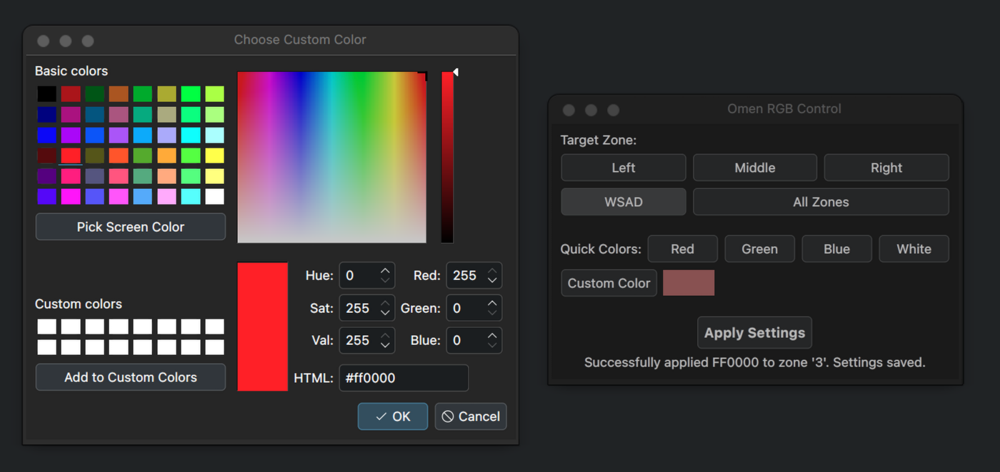

# Omen RGB GUI

 
<!-- Lub wersja HTML, jeśli preferujesz z podpisem i kontrolą rozmiaru:
<p align="center">
  
  <br />
  <em>Omen RGB GUI controlling keyboard backlights.</em>
</p>
-->

A simple GUI prototype to control HP Omen 4-zone keyboard RGB lighting on Linux using the hp-wmi kernel module.

## Features

*   Set static color for individual zones (0-3) or all zones at once.
*   Uses Polkit (`pkexec`) for privilege escalation to write to sysfs.
*   Color picker for easy color selection.
*   Live preview of the selected color.

## Dependencies

*   Python 3
*   PyQt6 (`pip install PyQt6`)
*   A working `hp-wmi` kernel module (such as the one from [hp-omen-linux-module](https://github.com/cousteauche/hp-omen-linux-module) or a similar custom version) exposing `/sys/devices/platform/hp-wmi/rgb_zones/zoneXX_rgb` files (where XX are hex digits 00-03). **Important:** Keyboard backlighting must be enabled via Fn-keys first.
*   Polkit (`polkit` package, usually installed by default on desktop Linux distributions).
*   `pkexec` command (part of Polkit).

## Installation

1.  **Kernel Module:**
    *   Ensure a compatible `hp-wmi` kernel module with RGB support is installed and loaded.
    *   Verify that the sysfs interface `/sys/devices/platform/hp-wmi/rgb_zones/` exists and its files are writable by root.
    *   **Crucially, make sure your keyboard's backlight is turned ON using your laptop's Fn-key combination (e.g., Fn + F4, Fn + F5, or a dedicated backlight key).** The GUI can only change colors if the backlight is already powered on.

2.  **Helper Script (`omen-rgb-helper.sh`):**
    This script is called by the GUI via `pkexec` to write colors to sysfs with root privileges.
    *   Copy the `helper/omen-rgb-helper.sh` script from this repository to a location in the system's PATH accessible by root. A common location is `/usr/local/bin/`:
        ```bash
        sudo cp helper/omen-rgb-helper.sh /usr/local/bin/omen-rgb-helper.sh
        ```
    *   Make the helper script executable:
        ```bash
        sudo chmod +x /usr/local/bin/omen-rgb-helper.sh
        ```

3.  **Polkit Policy File (`com.github.cousteauche.omenrgbgui.policy`):**
    This file grants permission for `pkexec` to run the helper script.
    *   **Verify the path in `policy/com.github.cousteauche.omenrgbgui.policy`**:
        Open the `.policy` file and ensure the line `<annotate key="org.freedesktop.policykit.exec.path">` points to the **absolute path** where you copied `omen-rgb-helper.sh` (e.g., `/usr/local/bin/omen-rgb-helper.sh`).
        ```xml
        <!-- Example snippet from the .policy file -->
        <action id="com.github.cousteauche.omenrgbgui.applyrgb">
          <!-- ... other tags ... -->
          <annotate key="org.freedesktop.policykit.exec.path">/usr/local/bin/omen-rgb-helper.sh</annotate>
          <!-- ... other tags ... -->
        </action>
        ```
    *   Copy the `.policy` file to the Polkit actions directory:
        ```bash
        sudo cp policy/com.github.cousteauche.omenrgbgui.policy /usr/share/polkit-1/actions/
        ```
    *   Polkit usually picks up new policy files automatically. If you encounter issues, a system reboot or restarting the Polkit service might be necessary (rarely needed).

4.  **Python Dependencies:**
    Install PyQt6 if you haven't already:
    ```bash
    pip install PyQt6
    # or, for a system-wide installation (consider virtual environments for development):
    # sudo pip install PyQt6 
    ```

## Usage

1.  **Turn on your keyboard backlight** using your laptop's Fn-key combination.
2.  Run the main Python script, typically `omen-rgb-gui.py`, from the directory where you cloned or downloaded the GUI:
    ```bash
    ./omen-rgb-gui.py
    ```
    Or, if it's not executable or you prefer:
    ```bash
    python omen-rgb-gui.py
    ```

Select the target zone(s) (Zone 0, Zone 1, Zone 2, Zone 3, or All Zones), choose a color using the "Choose Color" button, and then click "Apply Settings". You should be prompted for your administrator password by Polkit to authorize the color change.

## TODO

*   Read initial color values from sysfs on startup. This might require:
    *   Modifying the helper script to support a "read" action.
    *   Or, changing sysfs read permissions for the `zoneXX_rgb` files (e.g., via udev rules) so the GUI can read them directly without root.
*   More robust error handling and user feedback within the GUI (e.g., if the helper script fails or sysfs files are not found).
*   Potentially add sliders for R, G, B values for more fine-grained color selection.
*   Implement saving and loading color presets.
*   Package the GUI aplicação properly (e.g., using setuptools, `pyproject.toml`, or creating an AUR package for Arch Linux users).
*   Add support for brightness and animation controls once the underlying `hp-wmi` kernel module gains support for these features.

## Troubleshooting

*   **"Permission denied" or no color change:**
    *   Ensure the keyboard backlight is **ON** using your laptop's Fn-keys.
    *   Verify the `omen-rgb-helper.sh` script is in the correct location (`/usr/local/bin/` or as specified in the Polkit policy) and is executable.
    *   Double-check the path in your Polkit policy file.
    *   Check `dmesg` or `journalctl -f` for errors from the `hp_wmi` kernel module when applying colors.
*   **GUI doesn't start / Python errors:** Ensure PyQt6 is installed correctly.